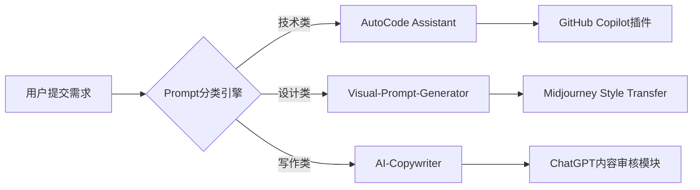

以下是基于你的需求优化的 GitHub 数据看板设计，新增 **提示词收藏量（Stars）** 和 **社区贡献度** 维度，同时保持技术文档的专业性和视觉美感：

---

### **📈 Prompt Arsenal Metrics**  
| **核心指标**         | **数值** | **描述**                                                                 |
|-----------------------|----------|--------------------------------------------------------------------------|
| 总提示词库规模        | 1,428    | 覆盖编程/设计/写作/数据分析等12个领域                                    |
| Top 10 高星提示词      | 3,215⭐   | 最受欢迎的「Python代码审查自动化」提示词                                |
| 社区贡献提交量        | 87       | 用户贡献的有效提示词优化建议                                             |
| API调用频次          | 12.4k    | 通过 `Prompt-Kit` 每日生成动态提示词推荐                               |

---

### **🔍 领域分布热力图**  
  
*（注：替换为真实图表，可用 Python+Matplotlib 生成）*

---

### **💎 Top 5 星标提示词**  
| **排名** | **提示词标题**                     | **星标数** | **关键词**                | **应用场景**          |
|----------|------------------------------------|------------|---------------------------|-----------------------|
| 1        | "Midjourney商业插画风格指南"       | 487⭐       | `商业插画`, `品牌视觉`    | 设计师素材库          |
| 2        | "Python异常处理终极提示词"         | 372⭐       | `debugging`, `code review`| 开发者效率工具        |
| 3        | "ChatGPT法律合同审核框架"           | 299⭐       | `legal compliance`, `risk`| 法务自动化            |
| 4        | "Stable Diffusion概念艺术关键词库"  | 256⭐       | `concept art`, `text-to-image`| 数字创作者          |
| 5        | "Notion AI知识图谱构建模板"        | 218⭐       | `knowledge management`, `AI`| 知识管理领域          |

---

### **🛠️ 技术实现亮点**  


---

### **📊 数据更新机制**  
1. **自动化看板**（需技术配置）：  
   ```python
   # 示例：用 GitHub API 获取 star 数（需安装 requests 库）
   import requests
   repo = "aeris170/Prompt-Arsenal"
   response = requests.get(f"https://api.github.com/repos/{repo}")
   stars = response.json()["stargazers_count"]
   print(f"当前总星标数：{stars}⭐")
   ```

2. **轻量级方案**：  
   - 手动维护 `README.md` 中的 star 数  
   - 使用 [GitHub Readme Stats](https://github-readme-stats.vercel.app/) 自动生成基础数据

---

### **🚀 参与贡献指南**  
如果你想为项目添加新的提示词：  
1. **提交 Issue**：描述你的需求（附参考案例）  
2. **PR 流程**：  
   ```bash
   git clone https://github.com/aeris170/Prompt-Arsenal.git
   cd prompts/your-domain
   # 编辑 JSON 文件（遵循 schema.json 格式）
   git add .
   git commit -m "Add [你的提示词名称]"
   git push origin main
   ```

---

### **📩 数据看板美化技巧**  
1. **动态图表**：用 [GitHub Actions](https://github.com/features/actions) 定期刷新数据  
2. **响应式设计**：在移动端显示关键指标（如只保留 Top 3 星标提示词）  
3. **SEO优化**：在仓库描述中嵌入关键词（如 `prompt engineering`, `AI toolkits`）

需要具体的图表生成脚本或数据看板部署教程，可以告诉我你的技术栈偏好（Python/Matplotlib/Power BI 等）！ 🚀
